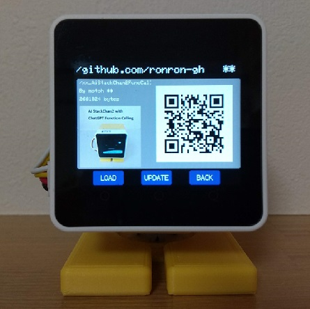
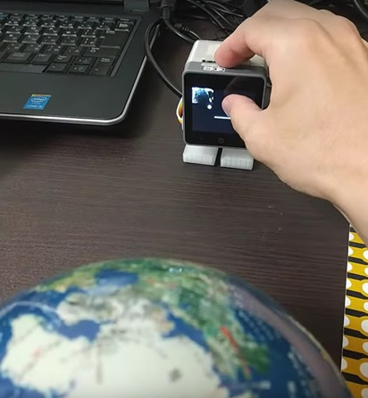

# AI_StackChan2_FuncCall
OpenAIのFunction Callingを使って、robo8080さんの[AIｽﾀｯｸﾁｬﾝ2](https://github.com/robo8080/AI_StackChan2)に様々な機能を追加しました。  
また、その他にもさまざまな機能拡張やリファクタリングを行っています。

※ｽﾀｯｸﾁｬﾝは[ししかわさん](https://x.com/stack_chan)が開発、公開している、手乗りサイズのｽｰﾊﾟｰｶﾜｲｲコミュニケーションロボットです。
- [Github](https://github.com/stack-chan/stack-chan)
- [Discord](https://discord.com/channels/1095725099925110847/1097878659966173225)
- [ScrapBox](https://scrapbox.io/stack-chan/)

<br>

---
**Table of Contents**
- [AI\_StackChan2\_FuncCall](#ai_stackchan2_funccall)
  - [開発環境](#開発環境)
  - [Function Callingで呼び出せる機能](#function-callingで呼び出せる機能)
  - [各種設定ファイル（SDカード）](#各種設定ファイルsdカード)
    - [■Wi-Fi設定、APIキー（必須）](#wi-fi設定apiキー必須)
    - [■基本設定（必須）](#基本設定必須)
    - [■その他、アプリケーション用設定](#その他アプリケーション用設定)
      - [●TTSの設定（必須）](#ttsの設定必須)
      - [●メール送受信用のGmailアカウント、アプリパスワード（任意）](#メール送受信用のgmailアカウントアプリパスワード任意)
      - [●天気予報のCity ID（任意）](#天気予報のcity-id任意)
      - [●NewsAPIのAPIキー（任意）](#newsapiのapiキー任意)
    - [■Function Calling用のデータファイル（任意）](#function-calling用のデータファイル任意)
      - [●バス（電車）の時刻表](#バス電車の時刻表)
      - [●アラーム音のMP3](#アラーム音のmp3)
  - [Function Calling以外の追加機能](#function-calling以外の追加機能)
    - [SD Updaterに対応（Core2のみ）](#sd-updaterに対応core2のみ)
    - [スケジューラ機能](#スケジューラ機能)
    - [複数のウェイクワードに対応](#複数のウェイクワードに対応)
    - [カメラ画像をGPT-4oに入力（CoreS3のみ）【new】](#カメラ画像をgpt-4oに入力cores3のみnew)
    - [カメラによる顔検出（CoreS3のみ）](#カメラによる顔検出cores3のみ)
  - [クラス設計の見直しについて【new】](#クラス設計の見直しについてnew)
    - [アプリケーション(MOD)一覧](#アプリケーションmod一覧)
  - [注意事項](#注意事項)
  - [バージョン履歴](#バージョン履歴)


## 開発環境
- デバイス：M5Stack Core2 / CoreS3
- IDE：Platformio (VSCode)

## Function Callingで呼び出せる機能
Function Callingで呼び出せる機能の一覧を下表に示します。

プロンプトや関数の実装は FunctionCall.cpp にまとめています。指示に応じてｽﾀｯｸﾁｬﾝが関数を使いこなしてくれます。FunctionCall.cppを改造することで、新たな機能を追加するなどのカスタマイズができます。

> ChatGPTのモデルはFunction Callingの精度を上げるためにGPT-4oにしています。GPT-4o miniに変更するにはFunctionCall.cpp内のプロンプトを編集してください。

```c
String json_ChatString = 
//"{\"model\": \"gpt-4o-mini\","
"{\"model\": \"gpt-4o\","
"\"messages\": [{\"role\": \"user\", \"content\": \"\"}],"
```


| No. | 機能 | 使用例 | デモ | 補足 |
| --- | --- | --- | --- | --- |
| 1 | 時刻 | 「今何時？」<br>「今日は何日？」<br>「今日は何曜日？」| |
| 2 | タイマー | 「3分のアラームをセットして」<br>「1時間後にパワーオフして」<br> 「タイマーをキャンセルして」| [動画(X)](https://twitter.com/motoh_tw/status/1675171545533251584) |
| 3 | メモ（SDカード） | 「～をメモして」<br>「これから言うことをメモして」<br>「メモを読んで」<br>「メモを消去して」||メモは notepad.txt というファイル名でSDカードに保存されます。|
| 4 | メール送信 | 「メモをメールして」<br>「～をメールして」|[動画(X)](https://twitter.com/motoh_tw/status/1686403120698736640)|GmailのアプリパスワードをSDカードに保存しておく必要があります（「各種設定ファイル」参照）。|
| 5 | メール受信 | 「メールを読んで」|[動画(X)](https://twitter.com/motoh_tw/status/1688132338293882880)|・送信と同じアプリパスワードを使います。<br>・メールサーバを5分毎に確認し、新しいメールがあれば「〇件のメールを受信しています」と教えてくれます。|
| 6 | バス（電車）時刻表 | 「次のバスの時間は？」<br>「その次は？」 |[動画(X)](https://twitter.com/motoh_tw/status/1686404335121686528)|時刻表をSDカードのファイルに保存しておく必要があります（「各種設定ファイル」参照）。|
| 7 | 天気予報 | 「今日の天気は？」<br>「明日の天気は？」 || ・robo8080さんが[Gistに公開してくださったコード](https://gist.github.com/robo8080/60a7bb619f6bae66aa97496371884386)を参考にさせていただきました。<br>・City IDはSDカードの設定ファイルで変更することができます（「各種設定ファイル」参照）。|
| 8 | ウェイクワード登録 | 「ウェイクワードを登録」<br>「ウェイクワードを有効化」|||
| 9 | リマインダ | 「新しいリマインダを設定して」|[動画(X)](https://twitter.com/motoh_tw/status/1784956121016627358)||
| 10 | 最新ニュース (NewsAPI連携) | 「今日のニュースは？」 || ・[K.Yamaさん(X)](https://twitter.com/USDJPY2010)から提供いただいたコードを参考にさせていただきました。<br>・APIキーをSDカードに保存しておく必要があります（「各種設定ファイル」参照）。|


## 各種設定ファイル（SDカード）
以降に示す設定ファイルを必要に応じてSDカードに保存してください。

> ・v0.8.0からSD UpdaterとYAML設定ファイルに対応したため、フォルダ、ファイルの構成が変更になりました。  
（YAMLの対応にはmongonta0716さんの[stackchan-arduinoライブラリ](https://github.com/mongonta0716/stackchan-arduino)を使用しています。）  
> ・従来のテキストファイルにも対応していますが、YAMLへの移行を推奨します。

### ■Wi-Fi設定、APIキー（必須）
以下の通り、YAMLファイルでWi-FiとAPIキーの設定をします。  
> ・APIキーはｽﾀｯｸﾁｬﾝとの会話に必須です。APIキーの取得方法などの詳細は[AIｽﾀｯｸﾁｬﾝ2のREADME](https://github.com/robo8080/AI_StackChan2_README/)を参照ください。  
> ・TTSのmodelやvoiceなどのパラメータ設定は後述の別ファイル（SC_ExConfig.yaml）で行います。


フォルダ：/yaml  
ファイル名：SC_SecConfig.yaml

```
wifi:
  ssid: "********"
  password: "********"

apikey:
  stt: "********"       # ApiKey of SpeechToText Service (OpenAI / Google Cloud TTSに対応)
  aiservice: "********" # ApiKey of AIService (ChatGPT)
  tts: "********"       # ApiKey of TextToSpeech Service (VoiceVox / ElevenLabs/ OpenAIに対応)
```


### ■基本設定（必須）
以下の通り、YAMLファイルでPWMサーボのピン番号、中央値、オフセット、サーボ種別を設定します。

フォルダ：/yaml  
ファイル名：SC_BasicConfig.yaml

```
servo: 
  pin: 
    # ServoPin
    # Core1 PortA X:22,Y:21 PortC X:16,Y:17
    # Core2 PortA X:33,Y:32 PortC X:13,Y:14
    # CoreS3 PortC X:18,Y:17
    # Stack-chanPCB Core1 X:5,Y:2 Core2 X:19,Y27
    # When using SCS0009, x:RX, y:TX (not used).(StackchanRT Version:Core1 x16,y17, Core2: x13,y14)
    x: 33
    y: 32
  center:
    # SG90 X:90, Y:90
    # SCS0009 X:150, Y:150
    # Dynamixel X:180, Y:270
    x: 90
    y: 90
  offset: 
    # Specified by +- from 90 degree during servo initialization
    x: 0
    y: 0

servo_type: "PWM" # "PWM": SG90PWMServo, "SCS": Feetech SCS0009
```

> SC_BasicConfig.yamlには他にも様々な基本設定が記述されていますが、現状、本ソフトが対応しているのは上記の設定のみです。


### ■その他、アプリケーション用設定
YAMLファイルでFunction Callingの各機能の設定をします。使わない機能についての設定はブランクでも問題ありません。  

フォルダ：/app/AiStackChan2FuncCall  
ファイル名：SC_ExConfig.yaml


#### ●TTSの設定（必須）
TTSの種類（VoiceVox, ElevenLabs, OpenAI TTS）の選択や、モデル、声質を設定します。

```
tts:
  type: 0                             # 0:VOICEVOX  1:ElevenLabs  2:OpenAI TTS

  model: ""                           # VOICEVOX (modelは未対応)
  #model: "eleven_multilingual_v2"    # ElevenLabs
  #model: "tts-1"                     # OpenAI TTS

  voice: "3"                          # VOICEVOX (ずんだもん)
  #voice: "AZnzlk1XvdvUeBnXmlld"      # ElevenLabs
  #voice: "alloy"                     # OpenAI TTS

```

#### ●メール送受信用のGmailアカウント、アプリパスワード（任意）
メール送受信機能を使う場合に設定が必要です。
- Gmailアカウントのメールアドレス
- Gmailアカウントのアプリパスワード（[こちら](https://support.google.com/mail/answer/185833?hl=ja)の説明に沿って取得してください）
- 送信先のメールアドレス


```
mail:
  account: "********@gmail.com"    # Gmailアカウントのメールアドレス
  app_pwd: "********"              # Gmailアカウントのアプリパスワード
  to_addr: "********@gmail.com"    # 送信先のメールアドレス
```

#### ●天気予報のCity ID（任意）
天気予報機能を使う場合に設定が必要です。  
City IDは[こちら](https://weather.tsukumijima.net/primary_area.xml)で調べることができます。

```
weather:
  city_id: "140010"     # 天気予報APIのCity ID
```

#### ●NewsAPIのAPIキー（任意）
News機能を使う場合に設定が必要です。  
APIキーは[NewsAPIのWEBページ](https://newsapi.org/)から取得できます(Developerプランであれば料金はかかりません)。

```
news:
  apikey: "********"    # NewsAPIのAPIキー
```

### ■Function Calling用のデータファイル（任意）

#### ●バス（電車）の時刻表
時刻表機能を使う場合は、SDカードに次のように時刻表を保存してください。
※現行は祝日の判別はできません。

フォルダ：/app/AiStackChan2FuncCall  
ファイル名：bus_timetable.txt（平日）、bus_timetable_sat.txt（土曜）、bus_timetable_holiday.txt（日曜）
```
06:01
06:33
06:53
・
・
・
21:33
22:03
22:33
```

#### ●アラーム音のMP3
SDカードに次のようにMP3ファイルを保存しておくと、タイマー機能やリマインダ機能のアラーム音として再生されます。

フォルダ：/app/AiStackChan2FuncCall  
ファイル名：alarm.mp3

> SDカードの相性により音が途切れることがあるため、起動時にMP3ファイルをSPIFFSにコピーして使用するように改善しました。すでにSPIFFSにalarm.mp3が存在する場合は起動時のコピーは行われません。


## Function Calling以外の追加機能
### SD Updaterに対応（Core2のみ）


SD Updaterに対応し、NoRiさんの[BinsPack-for-StackChan-Core2](https://github.com/NoRi-230401/BinsPack-for-StackChan-Core2)で公開されている他のSD Updater対応アプリとの切り替えが可能になりました。

【適用方法】  
① env:m5stack-core2-sduでビルドする。  
② ビルド結果の.pio/build/m5stack-core2-sdu/firmware.binを適切な名前（xx_AiStackChan2FuncCall.bin等）に変更し、SDカードのルートディレクトリにコピーする。

> ・本リポジトリのCopy-to-SDフォルダにビルド済みのbinファイルを置いています。  
> ・現状、Core2 V1.1ではランチャーソフトが動作しないため切り替えはできません。


### スケジューラ機能
時間を指定して任意のコールバック関数を実行することができます。サンプルとして次の動きを実装してあります。

- 毎朝6:30 省エネモードから復帰
- 毎朝7:00 今日の日付、天気、メモの内容を話す (ChatGPT＋Function Callを使用)
- 毎晩23:30 省エネモードに遷移
- 時報（7時から23時の間）
- 5分置きに受信メールを確認（7時から23時の間）

コールバック関数は、次のようにadd_schedule()という関数と、スケジュールの種類毎（時間指定、一定間隔で繰り返し等）に用意したScheduleクラスを使って登録します。

```c++
/* MySchedule.cpp */

void init_schedule(void)
{
    add_schedule(new ScheduleEveryDay(6, 30, sched_fn_wake));               //6:30 省エネモードから復帰
    add_schedule(new ScheduleEveryDay(7, 00, sched_fn_morning_info));       //7:00 今日の日付、天気、メモの内容を話す
    add_schedule(new ScheduleEveryDay(7, 30, sched_fn_morning_info));       //7:30 同上
    add_schedule(new ScheduleEveryDay(23, 30, sched_fn_sleep));             //23:30 省エネモードに遷移

    add_schedule(new ScheduleEveryHour(sched_fn_announce_time, 7, 23));     //時報（7時から23時の間）

    add_schedule(new ScheduleIntervalMinute(5, sched_fn_recv_mail, 7, 23)); //5分置きに受信メールを確認（7時から23時の間）
}
```

各ScheduleクラスはScheduleBaseクラスを継承しており、仮想関数run()をどのようにオーバライドするかによって異なる動き（時間指定、一定間隔で繰り返し等）を実現しています。現在用意しているScheduleクラスは次の通りです。

| クラス | 動作 | 備考 |
| --- | --- | --- |
| ScheduleEveryDay | 毎日、指定した時間にコールバック関数を実行する | |
| ScheduleEveryHour | 毎時、コールバック関数を実行する（主に時報用）| |
| ScheduleIntervalMinute | 指定した間隔[分]でコールバック関数を繰り返し実行する | |
| ScheduleReminder | 一度だけ指定した時間にコールバック関数を実行する | Function Callのリマインダー機能で使用している |


### 複数のウェイクワードに対応
AIｽﾀｯｸﾁｬﾝ2同様、ウェイクワードに対応しています。使い方は[AIｽﾀｯｸﾁｬﾝ2のREADME](https://github.com/robo8080/AI_StackChan2_README/)を参照ください。  

また、v0.6.0から、ウェイクワードを10個まで登録することが可能です。これにより、家族全員の声に反応するようにすることも可能になりました。

登録したウェイクワードのデータはSPIFFSにwakeword#.binという名前で保存されます。現行、10個に到達すると新たなウェイクワードは登録できませんので、Function Callingで「ウェイクワードの#番を削除して」とお願いするか、FFFTP等のFTPクライアントソフトで不要なウェイクワードを削除してください（FTPはユーザ名：stackchan、パスワード：stackchan）。

FFFTPでSPIFFSのファイル一覧を取得した様子


> ウェイクワードの誤認識が気になる場合は、WakeWord.h内のDIST_THRESHOLD の値を小さくすると誤認識を減らせますが、小さくし過ぎると逆に正しい呼びかけにも反応しづらくなります。

```
#define DIST_THRESHOLD  (250)
```

> CoreS3はA、Bボタンがないため、ウェイクワードの登録、有効化はFunction Callingで「ウェイクワードを登録」「ウェイクワードを有効化」というように指示してください。

### カメラ画像をGPT-4oに入力（CoreS3のみ）【new】



この写真のように、対象物をカメラで捉えた状態で額部分をタッチして会話を開始することで、「これは何？」といった質問が可能になります。

> この機能はデフォルトでONですが、OFFにしたい場合はLCDのカメラ画像の部分をタッチしてください。カメラ画像が表示されなくなり、通常の画像入力なしの会話になります。

### カメラによる顔検出（CoreS3のみ）


- 顔を検出すると音声認識を起動します。
  - LCD中央左側をタッチするとサイレントモードになり、顔検出しても起動しません。（代わりに、顔検出している間ｽﾀｯｸﾁｬﾝが笑顔になります。）
- LCDの左上隅にカメラ画像が表示されます。画像部分をタッチすると表示ON/OFFできます。

※顔検出は初期状態ではplatformio.iniで以下のようにコメントアウトし無効化しています。
```
build_flags=
  -DBOARD_HAS_PSRAM
  -DARDUINO_M5STACK_CORES3
  ;-DENABLE_FACE_DETECT
  -DENABLE_WAKEWORD
```

## クラス設計の見直しについて【new】
moddable版ｽﾀｯｸﾁｬﾝ（本家と呼ばれている[リポジトリ](https://github.com/stack-chan/stack-chan)）のクラス設計に合わせる形で、次のようにクラス設計を見直しています。
- 基本機能に関わるクラスをRobotクラスに集約（まだ完全ではないので、少しずつ集約していきます）
- 基本機能とアプリケーション(MOD)を分離

また、アプリケーションは下記のように複数登録して、実行中にLCDを左右にフリックすることで切り替えることができます（[Xの動画](https://x.com/motoh_tw/status/1841867660746789052)）。

```c++
[main.cpp]
ModBase* init_mod(void)
{
  ModBase* mod;
  add_mod(new AiStackChanMod());      // AI Stack-chan
  add_mod(new PomodoroMod());         // Pomodoro Timer
  add_mod(new StatusMonitorMod());    // Status Monitor
  mod = get_current_mod();
  mod->init();
  return mod;
}
```
### アプリケーション(MOD)一覧
| No. | アプリ名 | 説明(使い方) | 補足 |
| --- | --- | --- | --- |
| 1 | AIｽﾀｯｸﾁｬﾝ(Function Calling対応) | 本リポジトリのメインアプリです。 | |
| 2 | ポモドーロタイマ | 25分のアラームと5分のアラームを交互に繰り返すアプリです。<br>ボタンA：スタート/ストップ<br>ボタンC：無音モード解除/設定 | 初期状態は無音モードです。|
| 3 | デジタルフォトフレーム【new】 | SDカードのフォルダ "/app/AiStackChan2FuncCall/photo" に保存したJPEGファイルをLCDに表示します。<br>ボタンA：次の写真を表示 <br>ボタンC：スライドショー開始 | ・SDカードに保存するJPEGファイルはサイズを320x240にしておく必要があります。<br>・開発中、SDカードがマウント不可になり、再フォーマットしないと復旧しない事象が発生していました。改善したつもりですが、念のためSDカードのデータはバックアップをお願いします。|
| 4 | ステータスモニタ | 各種システム情報を表示します。| |

## 注意事項
- フォルダ名が長いため、ワークスペースの場所によってはライブラリのインクルードパスが通らない場合があります。
なるべくCドライブ直下に近い場所をワークスペースにしてください。(例 C:\Git)

## バージョン履歴
- v0.0.1
  - 初回リリース
- v0.1.0
  - ChatGPTへのリクエストを10回までループできるようにして、Function Callingで複数の関数を連携できるようにした。
- v0.2.0
  - ウェイクワードに対応。
  - Function Callingで呼び出せる機能を追加。
    - 追加した機能：メモ（SDカード）、メール送信、バス（電車）時刻表、天気予報
- v0.3.0
  - メール受信機能を追加。
  - その他軽微な改善や不具合修正。
- v0.4.0
  - Function Callingの機能にウェイクワード登録、有効化を追加。
  - LEDパネル（NeoPixel互換LED搭載 HEXボード ）による状態表示に対応（CoreS3のみ）。
- v0.4.1
  - LEDパネルの点灯パターンを追加。
- v0.5.0
  - カメラの顔検出による起動に対応。
  - タイマー機能のアラーム音としてSDカード内のMP3を再生するように改修。
- v0.5.1
  - SDカードのMP3（アラーム用）をSPIFFSにコピーすることで、安定して再生できるように改善。
- v0.5.2
  - Core2 v1.1に対応
- v0.6.0
  - ウェイクワードを10個まで登録できるように機能拡張。
  - FTPサーバ機能（SPIFFS）を追加。
  - アラーム機能実行中に残り時間を吹き出しで表示するように修正。
  - コードの一部をリファクタリング。
  - Open AI用RootCA証明書を更新。
- v0.7.0
  - Function Callの実行において情報が不足している場合にｽﾀｯｸﾁｬﾝから自発的に質問をするように改善。
  - Function Callの機能にリマインダーを追加。
  - スケジューラ機能を追加。
- v0.8.0
  - SD Updaterに対応。
  - YAMLの設定ファイルに対応。
  - ステータス表示画面を追加。
  - ChatGPTのモデルをGPT4oに変更。
  - Open AI用RootCA証明書を更新。
- v0.9.0
  - GPT4oへのカメラ画像入力に対応。
  - ElevenLabsとOpenAIのTTSに対応（YAMLファイルでTTSを選択）。
  - シリアルサーボSCS0009に対応（YAMLファイルでサーボ種類を選択）。
  - クラス設計をmoddable版ｽﾀｯｸﾁｬﾝを参考に見直し。複数のアプリーケーション(MOD)を画面のフリックで切り替え。
  - LEDパネル（NeoPixel互換LED搭載 HEXボード）のサポートを終了。
- v0.9.1
  - アプリケーション(MOD)にデジタルフォトフレームを追加。

