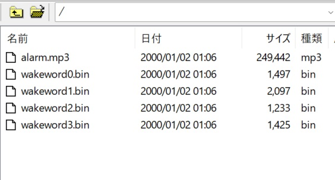
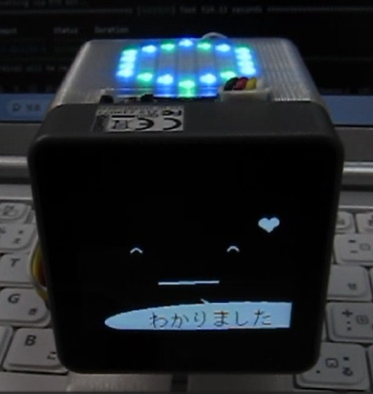
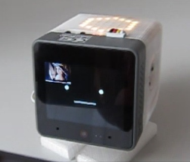

# AI_StackChan2_FuncCall
OpenAIのFunction Callingを使って、robo8080さんの[AIｽﾀｯｸﾁｬﾝ2](https://github.com/robo8080/AI_StackChan2)に様々な機能を追加しました。  

※Function Callingを使わない通常の会話もできます。  
<br>

---

- [AI\_StackChan2\_FuncCall](#ai_stackchan2_funccall)
  - [開発環境](#開発環境)
  - [ポート設定](#ポート設定)
  - [Function Callingで呼び出せる機能](#function-callingで呼び出せる機能)
  - [各種設定ファイル](#各種設定ファイル)
      - [●各種APIキー（必須）](#各種apiキー必須)
      - [●メール送受信用のGmailアカウント、アプリパスワード](#メール送受信用のgmailアカウントアプリパスワード)
      - [●バス（電車）の時刻表](#バス電車の時刻表)
      - [●天気予報のCity ID](#天気予報のcity-id)
      - [●アラーム音のMP3](#アラーム音のmp3)
      - [●NewsAPIのAPIキー](#newsapiのapiキー)
  - [その他追加した機能](#その他追加した機能)
    - [複数のウェイクワードに対応](#複数のウェイクワードに対応)
    - [LEDパネルによる状態表示（CoreS3のみ）](#ledパネルによる状態表示cores3のみ)
    - [カメラによる顔検出（CoreS3のみ）](#カメラによる顔検出cores3のみ)
    - [スケジューラ機能【new】](#スケジューラ機能new)
  - [注意事項](#注意事項)
  - [バージョン履歴](#バージョン履歴)


## 開発環境
- デバイス：M5Stack Core2 / CoreS3
- IDE：Platformio (VSCode)

## ポート設定
開発者はM5Stack Core2(白)とCoreS3を使用しており、ポート設定は次のようになっています。ご自身のハードウェアに合わせて変更してください。

| デバイス | ポートA | ポートB | ポートC |
| --- | --- | --- | --- |
| M5Stack Core2 | PWMサーボ | - | - |
| M5Stack CoreS3 | NeoPixel互換LED搭載 HEXボード | - | PWMサーボ |

サーボ用のポートは main.cpp 66行目付近で設定します。※シリアルサーボには対応していません。
```c
#define SERVO_PIN_X 33  //Core2 PORT A
#define SERVO_PIN_Y 32
```

HEXボード用のポートは HexLED.h 8行目付近で設定します。
```c
#define LED_DATA_PIN 2    //CoreS3 PORTA
```

## Function Callingで呼び出せる機能
Function Callingで呼び出せる機能の一覧を下表に示します。

プロンプトや関数の実装は FunctionCall.cpp にまとめています。指示に応じてｽﾀｯｸﾁｬﾝが関数を使いこなしてくれます。  
FunctionCall.cppを改造することで、新たな機能を追加するなどのカスタマイズができます。

※GPT-4を使うとFunction Callの回答の精度が高まる可能性があります（検証中）。GPT-4に変更するにはFunctionCall.cpp内のプロンプトを次のように編集してください（API利用料が上がるためお気を付けください）。

```c
String json_ChatString = 
//"{\"model\": \"gpt-3.5-turbo\","
"{\"model\": \"gpt-4\","
"\"messages\": [{\"role\": \"user\", \"content\": \"\"}],"
```


| No. | 機能 | 使用例 | デモ | 補足 |
| --- | --- | --- | --- | --- |
| 1 | 時計、タイマー | 「今何時？」<br>「今日は何日？」<br>「3分たったら教えて」<br>「1時間後にパワーオフして」<br> 「タイマーをキャンセルして」| [動画(X)](https://twitter.com/motoh_tw/status/1675171545533251584) |
| 2 | メモ（SDカード） | 「～をメモして」<br>「これから言うことをメモして」<br>「メモを読んで」<br>「メモを消去して」||メモは notepad.txt というファイル名でSDカードに保存されます。|
| 3 | メール送信 | 「メモをメールして」<br>「～をメールして」|[動画(X)](https://twitter.com/motoh_tw/status/1686403120698736640)|GmailのアプリパスワードをSDカードに保存しておく必要があります（「各種設定ファイル」参照）。|
| 4 | メール受信 | 「メールを読んで」|[動画(X)](https://twitter.com/motoh_tw/status/1688132338293882880)|・送信と同じアプリパスワードを使います。<br>・メールサーバを3分毎に確認し、新しいメールがあれば「〇件のメールを受信しています」と教えてくれます。|
| 5 | バス（電車）時刻表 | 「次のバスの時間は？」<br>「その次は？」 |[動画(X)](https://twitter.com/motoh_tw/status/1686404335121686528)|時刻表をSDカードのファイルに保存しておく必要があります（「各種設定ファイル」参照）。|
| 6 | 天気予報 | 「今日の天気は？」<br>「明日の天気は？」 || ・robo8080さんが[Gistに公開してくださったコード](https://gist.github.com/robo8080/60a7bb619f6bae66aa97496371884386)を参考にさせていただきました。<br>・City IDはSDカードの設定ファイルで変更することができます（「各種設定ファイル」参照）。|
| 7 | ウェイクワード登録 | 「ウェイクワードを登録」<br>「ウェイクワードを有効化」|||
| 8 | リマインダー【new】 | 「〇時〇分にリマインドして」|[動画(X)](https://twitter.com/motoh_tw/status/1784956121016627358)||
| 9 | 最新ニュース (NewsAPI連携) | 「今日のニュースは？」 || ・[K.Yamaさん(X)](https://twitter.com/USDJPY2010)から提供いただいたコードを参考にさせていただきました。<br>・APIキーをSDカードに保存しておく必要があります（「各種設定ファイル」参照）。|


## 各種設定ファイル
以下の設定ファイルを必要に応じてSDカードに保存してください。

#### ●各種APIキー（必須）
ｽﾀｯｸﾁｬﾝとお話するためには次のAPIキーをSDカードに保存する必要があります。APIキーの取得方法などの詳細は[AIｽﾀｯｸﾁｬﾝ2のREADME](https://github.com/robo8080/AI_StackChan2_README/)を参照ください。
  - ChatGPT
  - Google Cloud TTS
  - VoiceVox

#### ●メール送受信用のGmailアカウント、アプリパスワード
SDカードに次の順で保存してください。
- 自分のGmailアカウントのメールアドレス
- アプリパスワード（[こちら](https://support.google.com/mail/answer/185833?hl=ja)の説明に沿って取得してください）
- 送信先のメールアドレス

ファイル名：gmail.txt
```
XXXXXXXX@gmail.com 
XXXXXXXXXXXXXXXX
XXXXXXXX@XXXX.com
```

#### ●バス（電車）の時刻表
SDカードに次のように時刻表を保存してください。
※現行は祝日の判別はできません。

ファイル名：bus_timetable.txt（平日）、bus_timetable_sat.txt（土曜）、bus_timetable_holiday.txt（日曜）
```
06:01
06:33
06:53
・
・
・
21:33
22:03
22:33
```
#### ●天気予報のCity ID
SDカードに次のようにCity IDを保存してください（例は神奈川県のID）。

ファイル名：weather_city_id.txt
```
140010
```
City IDは[こちら](https://weather.tsukumijima.net/primary_area.xml)で調べることができます。

#### ●アラーム音のMP3
alarm.mp3という名前でSDカードに保存しておくと、タイマー機能のアラーム音として再生されます。MP3ファイルがない場合は、ｽﾀｯｸﾁｬﾝが「時間になりました」と話します。

note:  
SDカードの相性により音が途切れることがあるため、起動時にMP3ファイルをSPIFFSにコピーして使用するように改善しました。すでにSPIFFSにalarm.mp3が存在する場合は起動時のコピーは行われません。

#### ●NewsAPIのAPIキー
SDカードに次のようにAPIキーを保存してください。APIキーは[NewsAPIのWEBページ](https://newsapi.org/)から取得できます(Developerプランであれば料金はかかりません)。

ファイル名：news_api_key.txt
```
XXXXXXXXXXXXXXXXXXXX
```

## その他追加した機能
### 複数のウェイクワードに対応
AIｽﾀｯｸﾁｬﾝ2同様、ウェイクワードに対応しています。使い方は[AIｽﾀｯｸﾁｬﾝ2のREADME](https://github.com/robo8080/AI_StackChan2_README/)を参照ください。  

また、v0.6.0から、ウェイクワードを10個まで登録することが可能です。これにより、家族全員の声に反応するようにもできます。

登録したウェイクワードのデータはSPIFFSにwakeword#.binという名前で保存されます。現行、10個に到達すると新たなウェイクワードは登録できませんので、Function Callingで「ウェイクワードの#番を削除して」とお願いするか、FFFTP等のFTPクライアントソフトで不要なウェイクワードを削除してください（FTPはユーザ名：stackchan、パスワード：stackchan）。

FFFTPでSPIFFSのファイル一覧を取得した様子



※ウェイクワードの誤認識が気になる場合は、DIST_THRESHOLD の値を小さくすると誤認識を減らせますが、小さくし過ぎると逆に正しい呼びかけにも反応しづらくなります。

WakeWord.h
```
#define DIST_THRESHOLD  (250)
```

※CoreS3はA、Bボタンがないため、ウェイクワードの登録、有効化はFunction Callingで「ウェイクワードを登録」「ウェイクワードを有効化」というように指示してください。

### LEDパネルによる状態表示（CoreS3のみ）


CoreS3の場合、ポートAにLEDパネル（NeoPixel互換LED搭載 HEXボード ）を接続すると、次の状態に応じて点灯します。

- 起動完了（ドット絵の起動メッセージが流れる）
- 聞き取り中（青と緑の輪が点灯）
- 聞き取り成功（青と緑の輪が回転）
- 考え中（白い光が回転）
- 受信メールあり（黄色の輪がゆっくり点滅）

なお、起動完了時の流れるドット絵は次の手順で編集できます。

① tool/LED_Scroll_Pattern.xlsmでドット絵を編集してコードに変換する。  
② HexLED.cpp内の配列led_scroll_pattern01の値を①のコードに差し替える。

### カメラによる顔検出（CoreS3のみ）


- 顔を検出すると音声認識を起動します。
  - LCD中央左側をタッチするとサイレントモードになり、顔検出しても起動しません。（代わりに、顔検出している間ｽﾀｯｸﾁｬﾝが笑顔になります。）
- LCDの左上隅にカメラ画像が表示されます。画像部分をタッチすると表示ON/OFFできます。

※顔検出はメモリ消費量が多く動作が不安定になることがあるため、初期状態ではplatformio.iniで以下のように無効化されています。
```
build_flags=
  -DBOARD_HAS_PSRAM
  -DARDUINO_M5STACK_CORES3
  ;-DENABLE_FACE_DETECT
  -DENABLE_WAKEWORD
```


### スケジューラ機能【new】
時間を指定して任意のコールバック関数を実行することができます。サンプルとして次の動きを実装してあります。

- 毎朝6:30 省エネモードから復帰
- 毎朝7:00 今日の日付、天気、メモの内容を話す (ChatGPT＋Function Callを使用)
- 毎晩23:30 省エネモードに遷移
- 時報（7時から23時の間）
- 5分置きに受信メールを確認（7時から23時の間）

コールバック関数は、次のようにadd_schedule()という関数と、スケジュールの種類毎（時間指定、一定間隔で繰り返し等）に用意したScheduleクラスを使って登録します。

```c++
/* MySchedule.cpp */

void init_schedule(void)
{
    add_schedule(new ScheduleEveryDay(6, 30, sched_fn_wake));               //6:30 省エネモードから復帰
    add_schedule(new ScheduleEveryDay(7, 00, sched_fn_morning_info));       //7:00 今日の日付、天気、メモの内容を話す
    add_schedule(new ScheduleEveryDay(7, 30, sched_fn_morning_info));       //7:30 同上
    add_schedule(new ScheduleEveryDay(23, 30, sched_fn_sleep));             //23:30 省エネモードに遷移

    add_schedule(new ScheduleEveryHour(sched_fn_announce_time, 7, 23));     //時報（7時から23時の間）

    add_schedule(new ScheduleIntervalMinute(5, sched_fn_recv_mail, 7, 23)); //5分置きに受信メールを確認（7時から23時の間）
}
```

各ScheduleクラスはScheduleBaseクラスを継承しており、仮想関数run()をどのようにオーバライドするかによって異なる動き（時間指定、一定間隔で繰り返し等）を実現しています。現在用意しているScheduleクラスは次の通りです。

| クラス | 動作 | 備考 |
| --- | --- | --- |
| ScheduleEveryDay | 毎日、指定した時間にコールバック関数を実行する | |
| ScheduleEveryHour | 毎時、コールバック関数を実行する（主に時報用）| |
| ScheduleIntervalMinute | 指定した間隔[分]でコールバック関数を繰り返し実行する | |
| ScheduleReminder | 一度だけ指定した時間にコールバック関数を実行する | Function Callのリマインダー機能で使用している |

## 注意事項
- フォルダ名が長いため、ワークスペースの場所によってはライブラリのインクルードパスが通らない場合があります。
なるべくCドライブ直下に近い場所をワークスペースにしてください。(例 C:\Git)

## バージョン履歴
- v0.0.1
  - 初回リリース
- v0.1.0
  - ChatGPTへのリクエストを10回までループできるようにして、Function Callingで複数の関数を連携できるようにした。
- v0.2.0
  - ウェイクワードに対応。
  - Function Callingで呼び出せる機能を追加。
    - 追加した機能：メモ（SDカード）、メール送信、バス（電車）時刻表、天気予報
- v0.3.0
  - メール受信機能を追加。
  - その他軽微な改善や不具合修正。
- v0.4.0
  - Function Callingの機能にウェイクワード登録、有効化を追加。
  - LEDパネル（NeoPixel互換LED搭載 HEXボード ）による状態表示に対応（CoreS3のみ）。
- v0.4.1
  - LEDパネルの点灯パターンを追加。
- v0.5.0
  - カメラの顔検出による起動に対応。
  - タイマー機能のアラーム音としてSDカード内のMP3を再生するように改修。
- v0.5.1
  - SDカードのMP3（アラーム用）をSPIFFSにコピーすることで、安定して再生できるように改善。
- v0.5.2
  - Core2 v1.1に対応
- v0.6.0
  - ウェイクワードを10個まで登録できるように機能拡張。
  - FTPサーバ機能（SPIFFS）を追加。
  - アラーム機能実行中に残り時間を吹き出しで表示するように修正。
  - コードの一部をリファクタリング。
  - Open AI用RootCA証明書を更新。
- v0.7.0 (mainタグ)
  - Function Callの実行において情報が不足している場合にｽﾀｯｸﾁｬﾝから自発的に質問をするように改善。
  - Function Callの機能にリマインダーを追加。
  - スケジューラ機能を追加。


